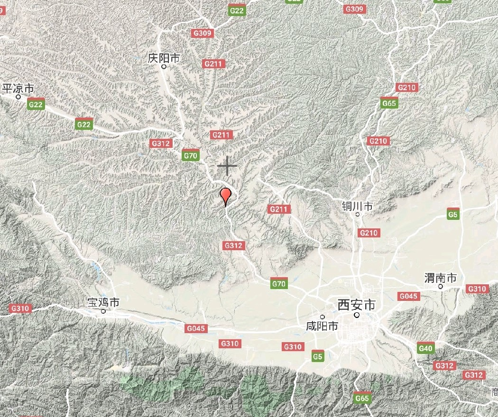
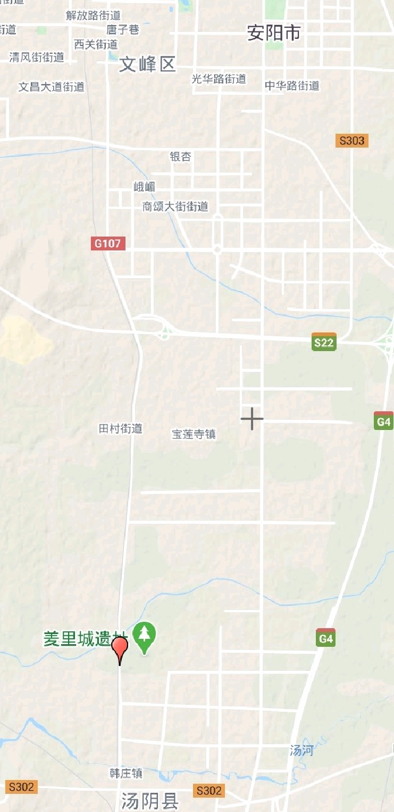

周之先祖名“弃”，母亲姜原出野见巨人足迹，心悦，故践之，有孕，生子，弃之河野，诸兽怜之，因名为“弃”。

弃为人好农，故名“后稷”。后稷卒，子不窋立。不窋末年，夏后氏政衰，去稷不务，不窋以失其官而犇**戎狄**之间。

不窋卒，子鞠立。鞠卒，子公刘立。公刘虽在戎狄之间，复修后稷之业，务耕种，行地宜，自漆、沮度渭，取材用，行者有资，居者有畜积，民赖其庆。百姓怀之，多徙而保归焉。周道之兴自此始，故诗人歌乐思其德。

公刘卒，子庆节立，国于**豳**。

庆节卒，子皇仆立。皇仆卒，子差弗立。差弗卒，子毁隃立。毁隃卒，子公非立。公非卒，子高圉立。高圉卒，子亚圉立。亚圉卒，子公叔祖类立。公叔祖类卒，子古公亶父立。

古公亶父即周文王父亲，古公亶父为人修德，决虞、芮之讼，务农，故诸侯多归之。

古公亶父生子三人，长曰太伯，次月虞仲。太姜生子季历，即周文王姬昌，有圣瑞，古公亶父认为周兴必在季历。

于是太伯、虞仲便跑到南方荆楚之地，断发文身，以示让贤。

季历之时，崇侯虎谮于纣，纣囚季历于**羑里**。

在此地，姬昌演八卦，做周易六十四卦。

姬昌四处征伐开拓疆土之时，祖尹已经劝谏纣当心，但纣说“不有天命乎？是何能为？”（《史记·周本纪》语）。这里要解释的是中国古代思想的一个演变，商周之际，流行的是天命观，即万事万物均有一个最高的主宰决定，人是被动的。

当周之时，周公旦总结商王朝灭亡教训，提出天命在民的思想，开中国千年民本思想之源。即“天视自我民视，天听自我民听”。

后世儒家“祖述尧舜，宪章文武，宗师仲尼”，其民本思想便源于此。

姬昌卒，武王立，三会诸侯，伐纣，周王朝建立。

文王立五十年而卒，其岁已九十七

