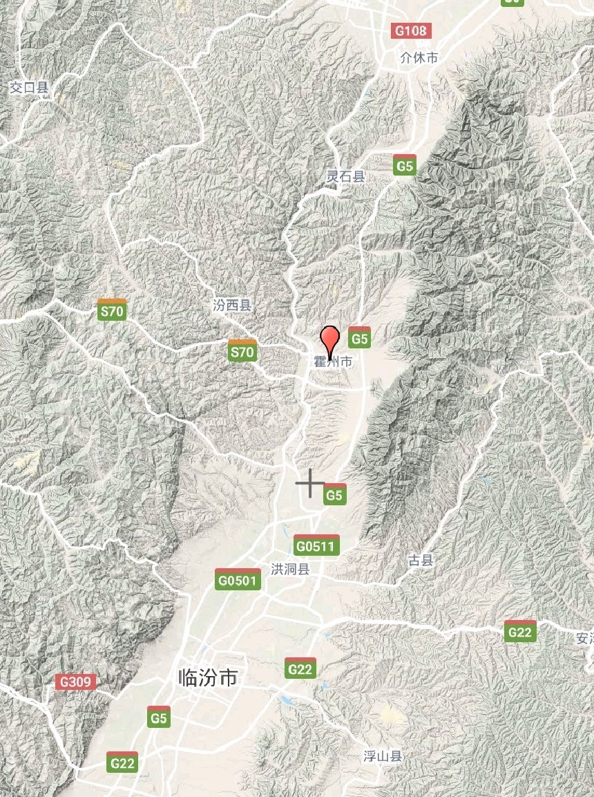
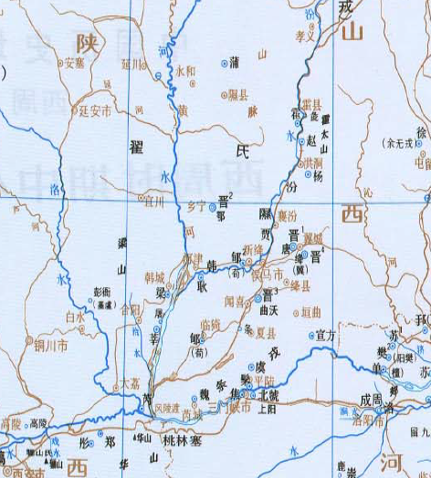

周厉王（前890年－前828年），姓姬，名胡，在西周青铜器铭文中作“㝬”[1]。为周夷王之子

厉王之时，道路以目，国人暴动，厉王出奔彘





召公将太子静隐匿在自己家中，让自己儿子代替去死，后召公与周公二相行政，号曰“共和”。

```
夷王崩，子厲王胡立。厲王即位三十年，好利，近榮夷公。大夫芮良夫諫厲王曰：「王室其將卑乎？夫榮公好專利而不知大難。夫利，百物之所生也，天地之所載也，而有專之，其害多矣。天地百物皆將取焉，何可專也？所怒甚多，不備大難。以是教王，王其能久乎？夫王人者，將導利而布之上下者也。使神人百物無不得極，猶日怵惕懼怨之來也。故《頌》曰『思文后稷，克配彼天，立我蒸民，莫匪爾極』。大雅曰『陳錫載周』。是不布利而懼難乎，故能載周以至于今。今王學專利，其可乎？匹夫專利，猶謂之盜，王而行之，其歸鮮矣。榮公若用，周必敗也。」厲王不聽，卒以榮公為卿士，用事。
```
```
王行暴虐侈傲，國人謗王。召公諫曰：「民不堪命矣。」王怒，得衛巫，使監謗者，以告則殺之。其謗鮮矣，諸侯不朝。三十四年，王益嚴，國人莫敢言，道路以目。厲王喜，告召公曰：「吾能弭謗矣，乃不敢言。」召公曰：「是鄣之也。防民之口，甚於防水。水壅而潰，傷人必多，民亦如之。是故為水者決之使導，為民者宣之使言。故天子聽政，使公卿至於列士獻詩，瞽獻曲，史獻書，師箴，瞍賦，矇誦，百工諫，庶人傳語，近臣盡規，親戚補察，瞽史教誨，耆艾修之，而後王斟酌焉，是以事行而不悖。民之有口也，猶土之有山川也，財用於是乎出：猶其有原隰衍沃也，衣食於是乎生。口之宣言也，善敗於是乎興。行善而備敗，所以產財用衣食者也。夫民慮之於心而宣之於口，成而行之。若壅其口，其與能幾何？」王不聽。於是國莫敢出言，三年，乃相與畔，襲厲王。厲王出奔於彘。
```
```
厲王太子靜匿召公之家，國人聞之，乃圍之。召公曰：「昔吾驟諫王，王不從，以及此難也。今殺王太子，王其以我為讎而懟怒乎？夫事君者，險而不讎懟，怨而不怒，況事王乎！」乃以其子代王太子，太子竟得脫。
```