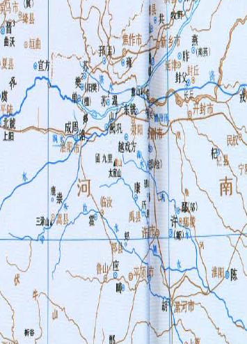

周平王（前781年－前720年），姓姬，名宜臼，东周第一位国王。周幽王之子，母申后为申侯之女，后母褒姒。

平王东迁洛邑，以避犬戎，实际上代表着周王室对西边已经无力掌控。
```
平王立，東遷于雒邑，辟戎寇。平王之時，周室衰微，諸侯彊并弱，齊、楚、秦、晉始大，政由方伯。
```
```
四十九年，魯隱公即位。
```
```	
五十一年，平王崩，太子洩父蚤死，立其子林，是為桓王。桓王，平王孫也
```

