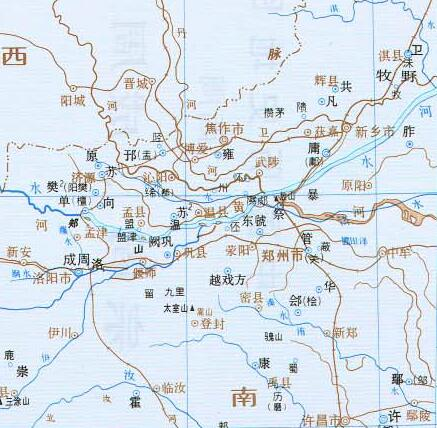

周成王，名诵，约前1055年－前1020年，武王姬发之子。

成王即位时年龄尚小，周公恐天下不定，故摄政当国。对于此事，钱穆先生评价为，周初定天下，还有很多不确定因素，必须得安排妥当，其中最需要注意的是关于殷商遗民的安置问题，他们是最大的隐患。

所以，在这个时候，管、蔡与武庚作乱，史称“三监之乱”。其地约在图中位置。



以微子代殷后，国于宋。周公国于鲁，周公行政七年，还政于王。


成王命召公营造洛邑，筑九鼎。

```
成王少，周初定天下，周公恐諸侯畔周，公乃攝行政當國。管叔、蔡叔群弟疑周公，與武庚作亂，畔周。周公奉成王命，伐誅武庚、管叔，放蔡叔。以微子開代殷後，國於宋。頗收殷餘民，以封武王少弟封為衛康叔。晉唐叔得嘉穀，獻之成王，成王以歸周公于兵所。周公受禾東土，魯天子之命。初，管、蔡畔周，周公討之，三年而畢定，故初作大誥，次作微子之命，次歸禾，次嘉禾，次康誥、酒誥、梓材，其事在周公之篇。周公行政七年，成王長，周公反政成王，北面就群臣之位。
```

```
成王在豐，使召公復營洛邑，如武王之意。周公復卜申視，卒營筑，居九鼎焉。曰：「此天下之中，四方入貢道里均。」作召誥、洛誥。成王既遷殷遺民，周公以王命告，作多士、無佚。召公為保，周公為師，東伐淮夷，殘奄，遷其君薄泵。成王自奄歸，在宗周，作多方。既絀殷命，襲淮夷，歸在豐，作周官。興正禮樂，度制於是改，而民和睦，頌聲興。成王既伐東夷，息慎來賀，王賜榮伯作賄息慎之命。
```