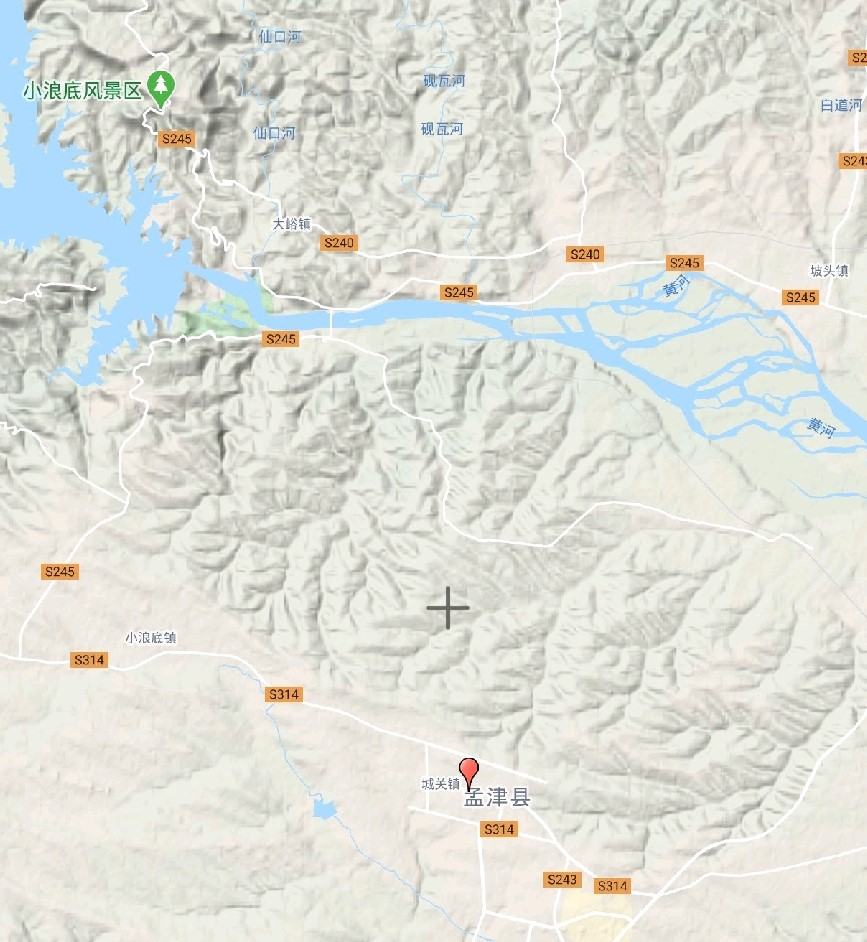

周武王，名姬发，西伯姬昌之子，八十四岁即位，十年而崩。（《史记》集解语）

武王当政，用太公、周公、召公，会盟诸侯，伐纣。

我们所应该注意的是，当武王伐纣之时，纣依然能够调动**七十万大军**，如果这个数字没有虚夸，那当时商的力量绝对不弱。如果纣不是如此不得人心，可能武王也恐怕无法取而代之，这个就可以解释为什么武王并非一即位便大张旗鼓地伐纣，并非天命不许，而是实力不足。

西伯四处征伐开疆拓土，武王时还要任用太公、周公，并且需要多次试探才敢伐纣。

武王伐纣，用木头做文王雕塑，自称太子，奉文王命伐纣，可见文王之盛名。

> 集解说武王八十四岁而立，有些匪夷所思，恐怕有不实之处。

武王即位，太公望为师，周公旦为辅，召公、毕公之徒左右王，师修文王绪业。

武王九年，第一次会盟诸侯与孟津



```
九年，武王上祭于畢。東觀兵，至于盟津。為文王木主，載以車，中軍。武王自稱太子發，言奉文王以伐，不敢自專。乃告司馬、司徒、司空、諸節：「齊栗，信哉！予無知，以先祖有德臣，小子受先功，畢立賞罰，以定其功。」遂興師。師尚父號曰：「總爾眾庶，與爾舟楫，後至者斬。」武王渡河，中流，白魚躍入王舟中，武王俯取以祭。既渡，有火自上復于下，至于王屋，流為烏，其色赤，其聲魄云。是時，諸侯不期而會盟津者八百諸侯。諸侯皆曰：「紂可伐矣。」武王曰：「女未知天命，未可也。」乃還師歸。
```
```
居二年，聞紂昏亂暴虐滋甚，殺王子比干，囚箕子。太師疵、少師彊抱其樂器而奔周。於是武王遍告諸侯曰：「殷有重罪，不可以不畢伐。」乃遵文王，遂率戎車三百乘，虎賁三千人，甲士四萬五千人，以東伐紂。十一年十二月戊午，師畢渡盟津，諸侯咸會。曰：「孳孳無怠！」武王乃作太誓，告于眾庶：「今殷王紂乃用其婦人之言，自絕于天，毀壞其三正，離逖其王父母弟，乃斷棄其先祖之樂，乃為淫聲，用變亂正聲，怡說婦人。故今予發維共行天罰。勉哉夫子，不可再，不可三！」
```
```
二月甲子昧爽，武王朝至于商郊牧野，乃誓。武王左杖黃鉞，右秉白旄，以麾。曰：「遠矣西土之人！」武王曰：「嗟！我有國冢君，司徒、司馬、司空，亞旅、師氏，千夫長、百夫長，及庸、蜀、羌、髳、微、纑、彭、濮人，稱爾戈，比爾干，立爾矛，予其誓。」王曰：「古人有言『牝雞無晨。牝雞之晨，惟家之索』。今殷王紂維婦人言是用，自棄其先祖肆祀不答，昏棄其家國，遺其王父母弟不用，乃維四方之多罪逋逃是崇是長，是信是使，俾暴虐于百姓，以姦軌于商國。今予發維共行天之罰。今日之事，不過六步七步，乃止齊焉，夫子勉哉！不過於四伐五伐六伐七伐，乃止齊焉，勉哉夫子！尚桓桓，如虎如羆，如豺如離，于商郊，不御克奔，以役西土，勉哉夫子！爾所不勉，其于爾身有戮。」誓已，諸侯兵會者車四千乘，陳師牧野。
```

```
帝紂聞武王來，亦發兵七十萬人距武王。武王使師尚父與百夫致師，以大卒馳帝紂師。紂師雖眾，皆無戰之心，心欲武王亟入。紂師皆倒兵以戰，以開武王。武王馳之，紂兵皆崩畔紂。紂走，反入登于鹿臺之上，蒙衣其殊玉，自燔于火而死。武王持大白旗以麾諸侯，諸侯畢拜武王，武王乃揖諸侯，諸侯畢從。武王至商國，商國百姓咸待於郊。於是武王使群臣告語商百姓曰：「上天降休！」商人皆再拜稽首，武王亦答拜。遂入，至紂死所。武王自射之，三發而後下車，以輕劍擊之，以黃鉞斬紂頭，縣大白之旗。已而至紂之嬖妾二女，二女皆經自殺。武王又射三發，擊以劍，斬以玄鉞，縣其頭小白之旗。武王已乃出復軍。
```
```
其明日，除道，修社及商紂宮。及期，百夫荷罕旗以先驅。武王弟叔振鐸奉陳常車，周公旦把大鉞，畢公把小鉞，以夾武王。散宜生、太顛、閎夭皆執劍以衛武王。既入，立于社南大卒之左，［左］右畢從。毛叔鄭奉明水，衛康叔封布茲，召公奭贊采，師尚父牽牲。尹佚筴祝曰：「殷之末孫季紂，殄廢先王明德，侮蔑神祇不祀，昏暴商邑百姓，其章顯聞于天皇上帝。」於是武王再拜稽首，曰：「膺更大命，革殷，受天明命。」武王又再拜稽首，乃出。
```
```
封商紂子祿父殷之餘民。武王為殷初定未集，乃使其弟管叔鮮、蔡叔度相祿父治殷。已而命召公釋箕子之囚。命畢公釋百姓之囚，表商容之閭。命南宮括散鹿臺之財，發鉅橋之粟，以振貧弱萌隸。命南宮括、史佚展九鼎保玉。命閎夭封比干之墓。命宗祝享祠于軍。乃罷兵西歸。行狩，記政事，作武成。封諸侯，班賜宗彝，作分殷之器物。武王追思先聖王，乃褒封神農之後於焦，黃帝之後於祝，帝堯之後於薊，帝舜之後於陳，大禹之後於杞。於是封功臣謀士，而師尚父為首封。封尚父於營丘，曰齊。封弟周公旦於曲阜，曰魯。封召公奭於燕。封弟叔鮮於管，弟叔度於蔡。餘各以次受封。
```
```
武王徵九牧之君，登豳之阜，以望商邑。武王至于周，自夜不寐。周公旦即王所，曰：「曷為不寐？」王曰：「告女：維天不饗殷，自發未生於今六十年，麋鹿在牧，蜚鴻滿野。天不享殷，乃今有成。維天建殷，其登名民三百六十夫，不顯亦不賓滅，以至今。我未定天保，何暇寐！」王曰：「定天保，依天室，悉求夫惡，貶從殷王受。日夜勞來定我西土，我維顯服，及德方明。自洛汭延于伊汭，居易毋固，其有夏之居。我南望三涂，北望嶽鄙，顧詹有河，粵詹雒、伊，毋遠天室。」營周居于雒邑而後去。縱馬於華山之陽，放牛於桃林之虛；偃干戈，振兵釋旅：示天下不復用也。
```
```	
武王已克殷，後二年，問箕子殷所以亡。箕子不忍言殷惡，以存亡國宜告。武王亦醜，故問以天道。
```
```
武王病。天下未集，群公懼，穆卜，周公乃祓齋，自為質，欲代武王，武王有瘳。後而崩，太子誦代立，是為成王。
```
